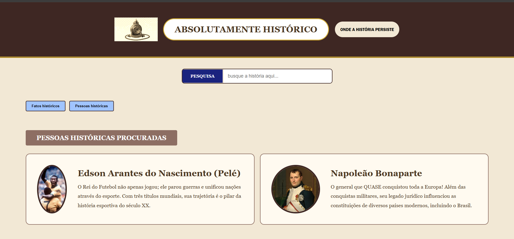
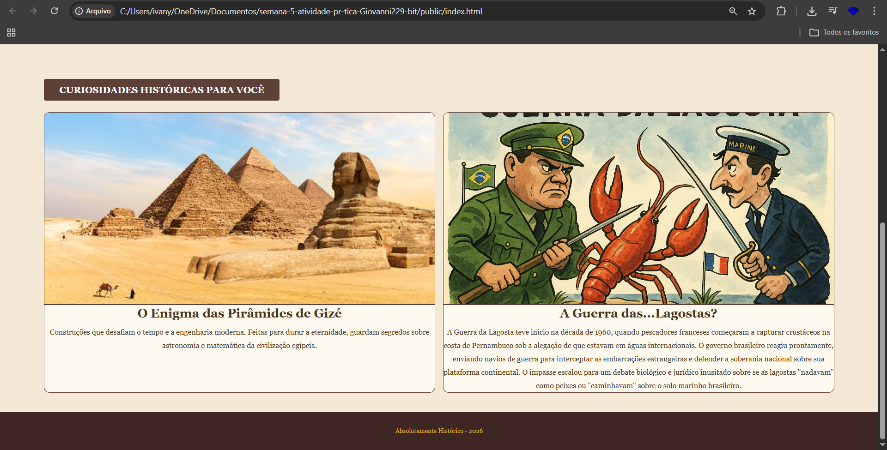
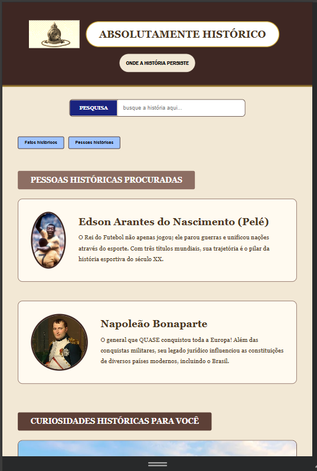
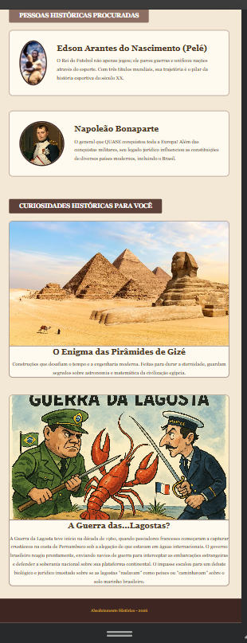

# Trabalho Prático - Semana 6

Nessa atividade, como sempre, vamos evoluir o que foi feito na semana anterior. Fique atento para fazer o projeto da semana anterior e dar sequência nessa jornada.

No trabalho dessa semana vamos alterar o projeto para que a responsividade da home-page seja feita, agora, com o framework Bootstrap.

**IMPORTANTE 1:** Você deve alterar apenas os arquivos **`README.md`**, **`index.html`** e **`styles.css`**, podendo incluir outros arquivos como imagens na pasta **`images`**, caso necessário. Deixe todos os demais arquivos e pastas desse repositório inalterados. **PRESTE MUITA ATENÇÃO NISSO.**

## Informações Gerais

- Nome: Giovanni
- Matricula: 908174
- Proposta de projeto escolhida: Pessoas e produções
- Breve descrição sobre seu projeto: O projeto aborda sobre pessoas históricas, seus feitos e também sobre outros fatos históricos.

## Print da versão responsiva com Bootstrap [DESKTOP]

.
 .

## Print da versão responsiva com Bootstrap [MOBILE] (*)

.
.

(*) Utilize as ferramentas do desenvolvedor do seu navegador para colocar no modo reponsivo, escolha um celular qualquer, recarregue a página antes de tirar o print. 